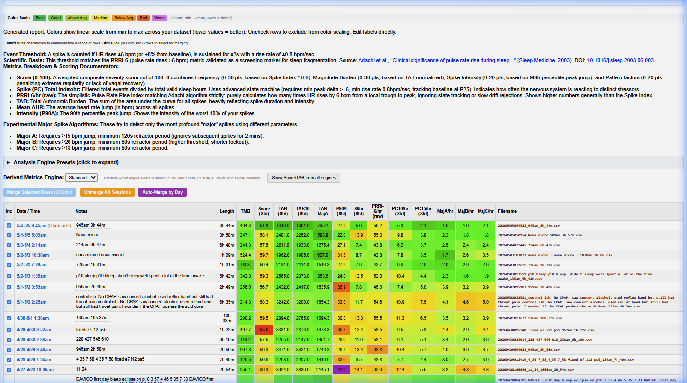
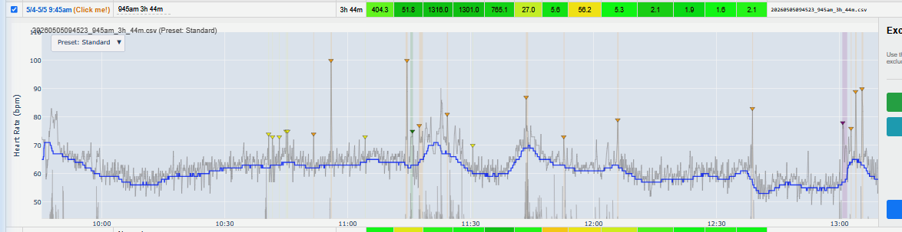

# O2Ring Auto Downloader & Sleep Analysis

A tool for [Wellue/Viatom O2Ring](https://getwellue.com/pages/o2ring-oxygen-monitor) users who want **more from their sleep data** than the official app provides — especially if you use [OSCAR](https://www.sleepfiles.com/OSCAR/) for CPAP/BiPAP analysis.

---

## Why Use This?

### 1. 📥 Automatic Cloud Download → OSCAR-Ready Files
Sync your O2Ring with the phone app as usual. This tool pulls your data directly from the Viatom cloud and saves it as `.dat`/`.bin` files that **OSCAR imports natively** — no manual exporting, no USB cables, no fiddling with the PC app.

It also automatically:
- **Merges split sessions** (the O2Ring often splits a 10-hour sleep into multiple 3-hour files)
- **Skips junk sessions** (brief tests, accidental starts)
- **Syncs your notes and star labels** from the cloud into filenames

### 2. 🔬 Advanced HR Spike Analysis (Especially Useful for UARS)
If you have **Upper Airway Resistance Syndrome (UARS)**, your AHI/RDI may look "normal" on a sleep study — but you still feel terrible. That's because UARS causes *subtle* breathing restrictions that trigger **heart rate spikes** (autonomic arousals) without full apneas or hypopneas.

This tool detects and scores those HR spikes using a sophisticated algorithm that goes far beyond simple counting:
- **Spike Index (SI/hr)** — how many times per hour your heart rate spiked
- **Total Autonomic Burden (TAB)** — combines spike frequency *and* intensity into one number
- **Sleep Score (0–100)** — a weighted composite that accounts for frequency, magnitude, spike intensity, and recovery patterns
- **P90Δ (90th percentile spike)** — how big your *worst* spikes are

These metrics help you and your doctor see whether your therapy changes are actually reducing sleep fragmentation, even when AHI stays the same.

### 3. 📊 Visual Comparison — See Your Trends Over Time
All the color-coding in the report is **relative to your own data, not absolute thresholds**. Green = your best nights, red = your worst nights. This makes it easy to spot trends:

> *"I can see where I started at the bottom with high scores, numbers got better as I made CPAP tweaks, then I tried a different pressure setting which showed a clear regression, and now things are improving again."*



This relative scaling means the tool works regardless of your age, baseline heart rate, or condition — you're always comparing against yourself.

### 4. 🧠 Smarter Than OSCAR's Built-In Pulse Change Detection
OSCAR has a "Pulse Change" event detector, but it's extremely basic. Here's what OSCAR does:

```
For each heart rate sample:
    Look ahead within a time window
    If any future sample differs by more than X bpm → flag it
    Jump ahead to that point and repeat
```

That's it. No baseline tracking, no rise-rate filtering, no state machine, no artifact rejection. It will happily flag:
- Slow, gradual heart rate drifts between sleep stages (not arousals)
- Single-sample PPG glitches from rolling over
- Post-spike recovery oscillations as new events (double-counting)

**This tool instead uses:**
- A **5-minute adaptive baseline** (25th percentile) that tracks your resting HR through sleep stage changes without being pulled up by spikes
- A **state machine** that models the full lifecycle of each spike (onset → peak → recovery → refractory), preventing double-counting by design
- **Rise-rate filtering** that ignores slow drifts and only catches sharp autonomic responses
- **Artifact rejection** for PPG noise and motion
- **Four sensitivity presets** (Sensitive, Standard, Specific, Clinical) calibrated against published research

The result: cleaner, more consistent spike counts that you can meaningfully compare across nights.

### 5. 🛠️ Interactive Dashboard With Powerful Tools
The generated HTML report isn't just a static table — it's a full interactive dashboard:

- **Auto-merge split sessions** — The O2Ring caps recordings at ~10 hours, splitting long sleeps into multiple files. One click merges them back together with properly weighted aggregate stats, or use "Auto-Merge by Day" to combine all same-night sessions at once.
- **Inline HR charts** — Click any night's date to expand a detailed interactive chart showing your heart rate trace, baseline, detected spikes, and motion data. No separate app needed.
- **Trim/blacklist wake time** — Left the ring on after waking up? Add `slice after 8:18 am` to a session's notes and all metrics are recalculated on just the sleep window. You can also use the chart's Excluded Regions sidebar for visual selection.
- **Multiple scoring engines** — Not all sleep fragmentation looks the same. Switch between Sensitive (catches subtle events, best for UARS screening), Standard (balanced), Specific (high-confidence only), and Clinical (matches published ≥10 bpm research thresholds) to find what best reflects *your* symptoms.



---

## Quick Start

### 1. Install `uv`
[`uv`](https://docs.astral.sh/uv/) is a free tool that handles installing Python and all required libraries automatically. You don't need to install Python separately.

#### Windows
1. Press the **Windows key**, type **PowerShell**, and click on it.
2. Paste this command and press Enter:
   ```powershell
   powershell -ExecutionPolicy ByPass -c "irm https://astral.sh/uv/install.ps1 | iex"
   ```
3. **Close and reopen PowerShell** to finish setup.

#### Linux / macOS
1. Open your **Terminal**.
2. Run:
   ```bash
   curl -LsSf https://astral.sh/uv/install.sh | sh
   ```
3. Close and reopen your terminal.

### 2. Get the Project
The best way (and easiest to update later) is with Git:
```bash
git clone https://github.com/AJolly/O2RingCloudDownloader
cd O2RingCloudDownloader
```
*(No Git? Click the green "Code" button on GitHub → "Download ZIP" → extract it.)*

### 3. Set Up Your Login
1. Find `o2_config.sample.ini` in the project folder.
2. Copy (or rename) it to `o2_config.ini`.
3. Open `o2_config.ini` in Notepad and fill in your Viatom/Wellue email and password.

> **Tip:** If you've used the official "O2 Insight Pro" PC app before, the tool will try to find your login automatically on first run. You may not need to edit the config at all.

### 4. Run It
**Windows:** In File Explorer, open the project folder. Click the address bar, type `powershell`, press Enter. Then run:
```powershell
uv run o2_downloader.py
```

**Linux/macOS:** Navigate to the project folder in your terminal, then:
```bash
uv run o2_downloader.py
```

The tool will download your data, generate CSV files, and (if enabled) produce an interactive HR analysis report that opens in your browser.

---

## Configuration (`o2_config.ini`)

Open `o2_config.ini` in any text editor:

| Setting | What it does | Default |
|---------|-------------|---------|
| `email` / `password` | Your Viatom/Wellue account login | *(required)* |
| `output_dir` | Where to save files | `data` |
| `generate_csv` | Create high-resolution CSV files (needed for HR analysis) | `true` |
| `run_analysis_report` | Run the HR Spike detector and open the HTML dashboard | `true` |
| `skip_short_sessions_under_mins` | Ignore sessions shorter than this | `60` |
| `launch_after` | Path to a program to open after download (e.g., OSCAR) | *(blank)* |

Example `launch_after`:
```ini
launch_after = C:\Program Files\OSCAR\OSCAR.exe
```

### Command Line Flags
Override config settings for a single run:
- `--output-dir "path"` — Custom output directory
- `--csv` / `--no-csv` — Force CSV generation on or off
- `--analyze` / `--no-analyze` — Force HR analysis on or off

---

## Understanding the HR Spike Report

When `run_analysis_report = true`, the tool generates `data/detector_results.html` — an interactive dashboard you open in your browser.

### What Am I Looking At?

The dashboard shows a **color-coded table of every night's sleep**. Each row is one recording session. The columns show different measurements of sleep fragmentation. Colors are scaled **relative to your own data**: green = your best nights, red = your worst.

**Click any date** to expand an interactive chart showing your heart rate, detected spikes, and motion data for that night.

### Key Metrics (Plain English)

| Column | What It Means | Lower = Better? |
|--------|--------------|-----------------|
| **Score** | Overall sleep disruption score (0–100). Combines everything below into one number. | ✅ Yes |
| **TAB** | Total Autonomic Burden. How much total "stress" your heart rate spikes represent — accounts for both how many spikes and how big they are. | ✅ Yes |
| **Spikes/hr (SI/hr)** | How many distinct HR spikes per hour. Think of it as "how often your nervous system reacted to something." | ✅ Yes |
| **P90Δ** | The size of your worst spikes (90th percentile). High = your biggest spikes are really big. | ✅ Yes |
| **Motion (TMB)** | How much you moved during the night. Helps distinguish real arousals from movement artifacts. | Depends |
| **PRRI-6/hr** | A simpler spike count matching published research (Adachi et al., 2003). Always higher than SI/hr because it doesn't filter out slow drifts. | ✅ Yes |

### How to Interpret Your Numbers

Because the color scale is relative, **your actual numbers matter less than the trend**. Focus on:

1. **Are my green nights clustered around therapy changes?** → Those changes are working.
2. **Did a setting change turn rows from green to red?** → That change made things worse.
3. **Is the overall trend getting greener over time?** → Your sleep is improving.

For rough absolute reference (based on the "Standard" engine):

| Metric | Typical Range | Concerning |
|--------|--------------|------------|
| Score | 10–40 | >60 consistently |
| SI/hr (spikes per hour) | 5–15 | >25 consistently |
| TAB | 100–500 | >800 consistently |

> ⚠️ **This is not a diagnostic tool.** These numbers help you and your doctor track trends. They don't replace a sleep study. If your numbers are consistently high, discuss them with your sleep specialist.

### Dashboard Features

- **Click a date** → Expand/collapse that night's interactive HR chart inline. The chart shows raw HR, adaptive baseline, detected spike markers, and motion — with a preset selector and excluded-regions sidebar built in.
- **Checkboxes** → Uncheck rows to exclude from color scaling (useful for outlier nights or nights you know were unusual)
- **Shift+Click checkboxes** → Enable/disable a range of rows at once
- **Ctrl+Click rows** → Select multiple rows, then hit **Merge Selected** to combine them. Useful for manually grouping related sessions.
- **Auto-Merge by Day** → One-click merge of all sessions that started on the same date. Since the O2Ring splits recordings at ~10 hours, a single night often produces 2-3 files. This combines them with properly weighted averages for all metrics.
- **Unmerge All / Restore** → Undo merges at any time. The original session data is never modified.
- **Edit labels** → Click any Notes cell and type. Changes persist in your browser's localStorage across reloads.
- **Engine selector** → Switch the derived metrics (SI/hr, P90Δ, PC10, PC15, TAB10) between four detection sensitivity presets. Each preset uses different thresholds for what counts as a "spike." Standard is recommended for most users; try Sensitive if you suspect subtle UARS arousals are being missed.

---

## Managing Your Data

### The `data` Folder
| File type | What it is |
|-----------|-----------|
| `.bin` / `.dat` | Raw files — import these into **OSCAR** |
| `.csv` | High-resolution 1-second HR/SpO2 data for analysis |
| `detector_results.html` | The HR Spike dashboard (open in any browser) |
| `charts/` | Individual per-night interactive charts |

### Ignoring Sessions
Add a session's timestamp (the 14-digit number at the start of the filename) to `ignored_sessions.txt` — one per line. The tool will skip it on future runs.

### Automatic Merging
If the O2Ring split your 10-hour sleep into multiple shorter files, the tool detects they belong together and creates a single merged file.

### Updating
If you installed with Git:
```bash
git pull
```
If you downloaded the ZIP, re-download from GitHub and extract over your existing folder (your `data/` folder and `o2_config.ini` won't be overwritten).

---

## Session Notes & Data Trimming

### Editing Labels
You can add notes to sessions in two ways:
1. **In the dashboard** — Click any Notes cell and type. Saved in your browser's localStorage.
2. **In the filename** — The tool encodes notes between the timestamp and the time/duration suffix.

### Trimming Wake Time ("slice after …")
If you woke up but left the ring recording, you can exclude the wake period. Add a directive to the session's notes:

```
slice after 8:18 am
```

All analysis metrics will be recalculated using only the sleep window before the cutoff. See [`analysis/REPORT_GUIDE.md`](analysis/REPORT_GUIDE.md) for full syntax and examples.

---

## How the Algorithm Works (For the Curious)

The HR spike detector uses a 5-stage pipeline:

1. **Preprocessing** — Filters out impossible HR values, rejects PPG artifacts (single-sample jumps >25 bpm), applies a 3-second median smooth
2. **Adaptive Baseline** — A rolling 5-minute 25th-percentile window that tracks your resting HR without being pulled up by spikes
3. **State Machine Detection** — Models each spike as: Onset → Rising → Peak → Recovery → Refractory. This prevents double-counting and handles complex spike morphologies (staircases, plateaus)
4. **Classification** — Categorizes spikes by shape (Type A: classic tachy-bradycardia, Type B: sustained awakening, Type C: brief, Type D: gradual rise)
5. **Scoring** — Computes per-hour normalized metrics (SI, TAB, Score) that are comparable across nights of different lengths

Full technical details: [`analysis/hr_spike_algo.md`](analysis/hr_spike_algo.md)

### Why Not Just Use OSCAR's Pulse Change?

OSCAR's `calcPulseChange()` is a straightforward sliding-window peak difference detector. For each HR sample, it scans ahead within a configurable time window and flags the maximum change:

```cpp
// Simplified OSCAR logic (from calcs.cpp):
for each sample i:
    for each sample j ahead of i within the window:
        if abs(HR[j] - HR[i]) > threshold:
            flag it, jump ahead to j
```

**Problems with this approach:**
- **No baseline tracking** — A slow HR rise from NREM to REM (completely normal) gets flagged the same as a sharp autonomic arousal
- **No rise-rate filtering** — Can't distinguish a 10 bpm spike over 3 seconds (arousal) from a 10 bpm drift over 60 seconds (sleep stage change)
- **Double-counting** — After a spike peaks and starts to fall, the recovery oscillation can trigger a second event
- **No artifact rejection** — PPG glitches from motion, PVCs, or poor perfusion are counted as real events
- **No refractory period** — The detector can immediately re-trigger on post-spike bradycardia

This tool's state-machine approach solves all of these. Each spike is tracked through its full lifecycle before the detector re-arms, producing cleaner and more reproducible results.

---

## Troubleshooting

**"Login failed"**
Double-check your email and password in `o2_config.ini`. If you use the PC app, make sure you've logged in there at least once.

**"No sessions found"**
Ensure your ring has synced with your phone app recently. The data must be in the "Cloud" for this tool to see it.

**"uv is not recognized"**
Make sure you restarted your PowerShell window after installing `uv`.

**Report looks wrong / old data**
Delete `data/detector_cache.json` to force a full re-analysis on the next run.

---

## References

- Adachi H, et al. *"Clinical significance of pulse rate rise during sleep as a screening marker for the assessment of sleep fragmentation."* Sleep Medicine, 2003. [PubMed](https://pubmed.ncbi.nlm.nih.gov/14607348/) | [DOI](https://doi.org/10.1016/j.sleep.2003.06.003)
- Bonnet MH, Arand DL. *"EEG Arousal Norms by Age."* JCSM, 2007. [PMC](https://pmc.ncbi.nlm.nih.gov/articles/PMC2564772/)
- Boulos MI, et al. *"Normal polysomnography parameters in healthy adults."* Sleep Medicine Reviews, 2019. [PMC](https://pmc.ncbi.nlm.nih.gov/articles/PMC11744251/)

> **Note on arousals and age:** Arousals are a normal feature of sleep and increase with age — ~19 arousals/hour is typical for adults over 60. Excessive frequency is associated with hypertension and cognitive impairment.
